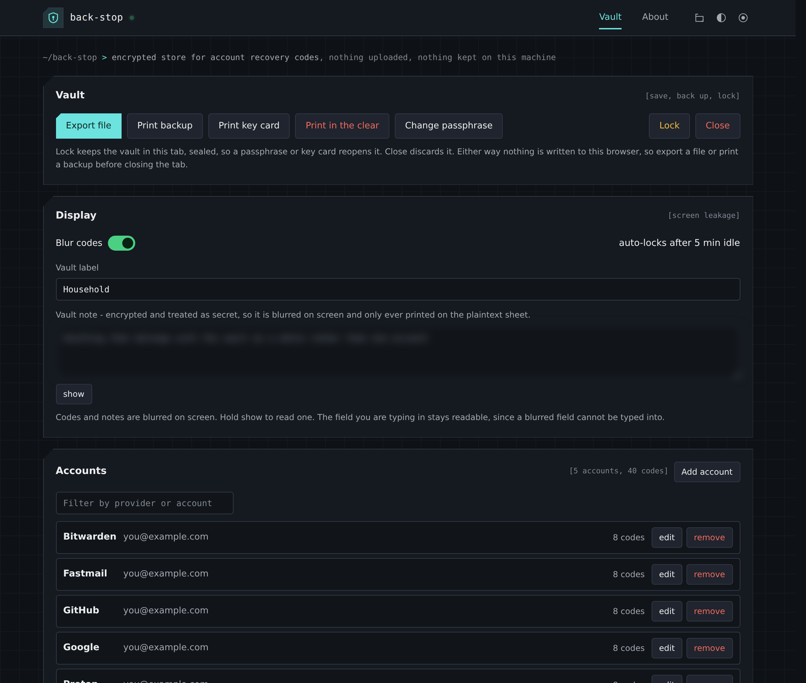

# back-stop

A private, offline store for account recovery codes: the one-time codes a
service gives you to get back in when your authenticator is gone. It holds
them encrypted, and gives you three ways to keep a copy that survive losing
your devices - an encrypted file, an encrypted printed backup, and a plaintext
sheet for a safe.



Download `index.html` and open it in a browser. There is nothing to install,
and it makes no network connections.

## Getting started

1. Open `index.html` and choose **New vault**. Use a passphrase of six or more
   unrelated words: length is what protects the vault.
2. **Add account** for each service, and paste in its recovery codes.
3. Keep a copy before you close the tab - nothing is saved in the browser.
   **Export file**, **Print backup**, or both.
4. **Print key card** and store it somewhere apart from everything else. It is
   your way back in if you forget the passphrase.

Next time, open the vault **From a file** or **From paper** and unlock it with
your passphrase or the key card.

## What it does

- Keeps a vault of accounts behind a passphrase, each with its recovery codes.
- Exports an encrypted `.json` file. Open it again later, add more, export again.
- Prints an encrypted QR backup for somewhere less trusted than a safe.
- Prints every code in plain text, three dense columns to a sheet, for a safe.
- Prints a key card that opens the vault without the passphrase.
- Restores from the exported file or the printed QR codes.
- Keeps free-text notes per account, and one for the vault as a whole, for
  anything that is not a list of codes.
- Keeps accounts in alphabetical order by provider.

## Keeping your copies safe

| | What you need to open it | Where it belongs |
|---|---|---|
| Exported file | this tool + passphrase or key card | disk, sync, wherever |
| Printed backup | a phone camera + passphrase or key card | a folder, a deposit box, a relative's house |
| Plaintext sheet | nothing | a safe |
| Key card | - | apart from all of the above |

The plaintext sheet is the strongest last resort precisely because it depends
on nothing: no passphrase, no scanner, no working copy of this tool. It is also
the one that is equivalent to the codes themselves, so it needs physical
protection rather than encryption. Keep it apart from the printed backup and
the key card.

**The key card opens the vault on its own.** That is what makes it a way back
in, and it is also why it must never be stored with the exported file or the
printed backup: together they give anyone full access.

### Paper only is a complete workflow

Nothing requires you to keep a `.json` file. Print a backup and a key card,
store them apart, and that is a whole strategy. **From paper** takes the
scanned text back in, and either the passphrase or the key card opens it.

To restore from paper, scan each QR code with your phone's camera app and paste
the text into **From paper**, in any order. The tool has no scanner of its own,
so this is easiest done entirely on a phone.

### Backups on several sheets

A large vault prints across more than one sheet - roughly a hundred codes fit
on one - and **every sheet is required**. Losing one sheet loses the whole
vault, not part of it.

That makes the usual advice, to keep copies in different places, actively
wrong for the sheets of a single backup: splitting three sheets across three
places turns one point of failure into three. Keep the sheets together, and for
a copy somewhere else, print a second complete set. Each sheet carries a
reminder of this.

## If you forget your passphrase

Open the vault with the key card, then choose **Change passphrase** and set a
new one. Export or print again so your copies use it.

If a key card is lost, or someone else has seen it, choose **Change
passphrase** and tick **Also replace the key**. That gives the vault a new key,
so every card printed before stops working. Print a new key card and a new
backup straight afterwards.

Neither can reach copies you made earlier. A file exported before the change
still opens with the old passphrase, and a backup printed before it still opens
with the old passphrase or the old card. If those are the reason you are
changing it, destroy them.

## Lock and close

**Lock** hides the vault but keeps it in the tab, so your passphrase or key card
reopens it without re-opening a file or re-scanning paper. The vault also locks
itself after five minutes idle.

**Close** discards it. Nothing is ever written to the browser, so export or
print before you close the tab.

## Opening a vault without this tool

`recover.py`, in this repository, opens an exported file or a scanned backup
and prints the codes, using nothing but Python. It is for the day this page is
not available - a backup you can only read with the tool that wrote it is a
bet that the tool still works in whatever browser you have in ten years.

    python3 recover.py vault.json            # passphrase, prompted
    python3 recover.py scanned.txt           # text scanned off the printed backup
    python3 recover.py vault.json --key      # use the key card instead
    python3 recover.py vault.json --json     # raw JSON rather than a listing
    pbpaste | python3 recover.py             # straight from a scan

It needs Python 3.6 or newer and nothing else: no `pip`, no internet. The
machine where you need it may be offline, locked down or borrowed, so it
deliberately depends on nothing. It works out which kind of input it has been
given, accepts the key card with the same tolerance for case and spacing as the
tool, and lists accounts in the same order.

It only reads. It never changes, re-encrypts or writes a vault, and it prints
to the screen rather than saving a file. If you redirect that output to a file,
remember the file is now your codes in plain text.

**Check your copy before you rely on it:**

    python3 recover.py --selftest

This runs published test vectors for the encryption, plus checks of the key
card format. Every check should pass. If any fail, that copy is damaged or has
been altered, so do not use it.

## What else it holds

Recovery codes are the first use, not the only one. Anything that is a small
text secret you need to survive losing your devices fits, which is what the
notes are for:

- **Break-glass credentials.** Emergency local administrator and root
  passwords, firewall enable secrets, out-of-band and IPMI logins, emergency
  access accounts. Classic sealed-envelope material, usually kept in a
  spreadsheet nobody trusts.
- **Disk encryption recovery keys.** BitLocker and FileVault. The key that
  unlocks a disk cannot usefully live on that disk.
- **Crypto seed phrases.** Short, catastrophic to lose, catastrophic to leak.
  The notes take the derivation path and wallet model alongside the words.
- **Offline root CA material.** Key ceremony data and root key passphrases.
- **Authenticator seeds, not just recovery codes.** The secret behind each
  authenticator entry, so a new phone can be set up again rather than using up
  a recovery code.
- **An estate file.** What an executor needs: which accounts exist, where the
  documents are, what to close. The plaintext sheet in a safe suits this,
  because nobody at that point will scan a QR code or know a passphrase.

### Where it is the wrong tool

- **A daily password manager.** No autofill, no browser integration, and a
  plaintext print button. The friction suits break-glass use and gets in the
  way of daily use.
- **Shared team secrets.** No multiple users, no access log, no record of who
  saw what.
- **Regulated or client data.** No audit trail, and a plaintext print option
  is a compliance problem waiting to happen.

## Privacy

- **Nothing leaves the page.** It cannot connect to the internet at all.
- **Nothing is saved in the browser.** Your codes and notes live in the tab's
  memory until you close it. The only thing stored is your choice of design,
  mode and accent.
- **Codes and notes are blurred on screen.** Hold **show** to read one. A field
  you are typing in stays readable, and everything re-blurs when you switch
  tabs or windows.
- **Only the three print buttons print anything.** Pressing Ctrl+P on its own
  prints a short notice and none of your data.
- **Printing in the clear asks first**, and says what the sheet means.
- **Spellcheck and autofill are off** in every field, since some browsers send
  what you type to a remote spellcheck service.
- **There are no copy buttons**, because clipboard history can sync between
  devices.
- **Closing the tab with a vault open asks first.**

Print on paper with a local printer. Printing to PDF saves your codes to disk,
and network printers can keep a copy of the job, so check the print queue
afterwards.

## Known limits

- **Your passphrase is the main protection for an exported file.** The key
  derivation is the strongest the browser offers without extra software, but
  someone with the file and enough computing power can still break a short
  passphrase. Use six or more unrelated words.
- **The key card opens the vault on its own.** Store it apart from the file and
  the printed backup, or the encryption buys nothing.
- **Changing the passphrase or key cannot recall old copies.** Destroy files
  and printouts made before the change if they are the reason for it.
- **The key card's typo check is good, not perfect.** A rare slip gets past it
  and then fails with the general "does not open this vault" message. Check
  the characters against the card again.
- **`recover.py` does its own decryption** rather than using a library, so it
  can run with nothing installed. It passes the published test vectors and
  opens vaults made by the tool, which is evidence but not an independent
  audit. It is the fallback for when the browser is gone, not the everyday way
  in.
- **If you use a hosted copy, you are trusting whoever hosts it**, since they
  control the page that handles your codes. Compare the hash of any hosted copy
  with your own `index.html` before entering anything real, or just use the
  file directly.

## Technical reference

For checking how the vault is protected, or for opening one without either
tool.

### Encryption

Envelope encryption. The vault body is AES-256-GCM under a random 256-bit data
key. That data key is wrapped with a second AES-256-GCM key derived from the
passphrase with PBKDF2-HMAC-SHA256, 600,000 iterations and a 16-byte random
salt. The passphrase is normalised to Unicode NFKC before derivation. The
additional authenticated data for both layers is the ASCII string
`back-stop-vault-1`, and each encryption uses a fresh random 12-byte nonce.

The data key stays the same across exports, so a key card keeps working as the
vault grows. **Change passphrase** re-wraps the same key under a new
passphrase, with a new salt; **Also replace the key** generates a new data key.

### Key card

The key card holds the 32-byte data key in Crockford base32: one case, and the
letters `I`, `L`, `O` and `U` never appear. On input `I` and `L` read as `1`
and `O` as `0`, and spaces, line breaks and case are ignored. The 52 characters
of key are followed by 2 check characters, the first two Crockford digits of
`SHA-256(key)`, so a single-character slip is reported as a typo. The card also
carries the same string as a QR code.

### Exported file

```json
{
  "app": "back-stop", "format": "back-stop-vault-1", "schema": 1,
  "kdf":  { "alg": "PBKDF2-SHA256", "iter": 600000, "salt": "base64" },
  "wrap": { "alg": "A256GCM", "iv": "base64", "ct": "base64" },
  "body": { "alg": "A256GCM", "comp": "gzip", "iv": "base64", "ct": "base64" }
}
```

### Printed backup

The QR codes carry this binary layout, base64 encoded and split across codes,
each prefixed `BS1:i/n:`. Join them in order of `i` before decoding. The layout
is also printed on the backup itself.

| Field | Bytes |
|---|---|
| magic `BS` | 2 |
| envelope version | 1 |
| PBKDF2 iterations / 1000, big endian | 2 |
| PBKDF2 salt | 16 |
| wrapped-key nonce | 12 |
| wrapped 32-byte data key + 16-byte tag | 48 |
| body nonce | 12 |
| flags, bit 0 set when the body is gzipped | 1 |
| body ciphertext + tag | rest |

## Files

    index.html    the tool. One file, open it in a browser.
    recover.py    opens a vault without the browser. Python standard library only.
    README.md     this file.
    LICENSE       MIT.
    _headers      security headers, if you host it on Netlify or similar.
    .htaccess     the same for Apache.
    docs/         the screenshot above.

## Licence

MIT, Shane McElhinney.
